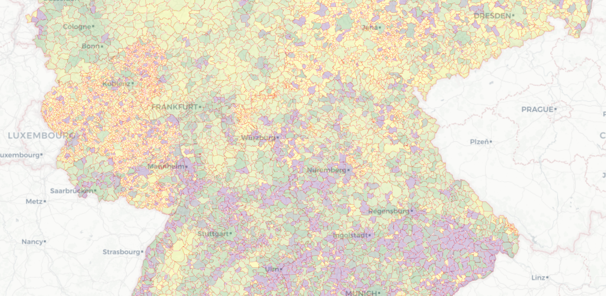

# Visualizing the installed pv power per area for urban and rural communes in Germany

In this small project we will try to get an overview of the installed power from photovoltaics per area in units of  for every administrative district in Germany for the low- and medium-voltage power grid, thus providing us with an interactive heatmap, showing low and high concentrations of pv penetration over the country as a whole.

The commented script can be found [here](./Installed pv power per area - Germany.ipynb). The resulting heatmap as an html file is found [here](./results/installed_power_LVMV_per_area_2019.html).

>>>
**NOTE** The html file is larger than 10MB and cannot be displayed inside GitLab. Download and open it locally in your browser of choice. 
>>>
